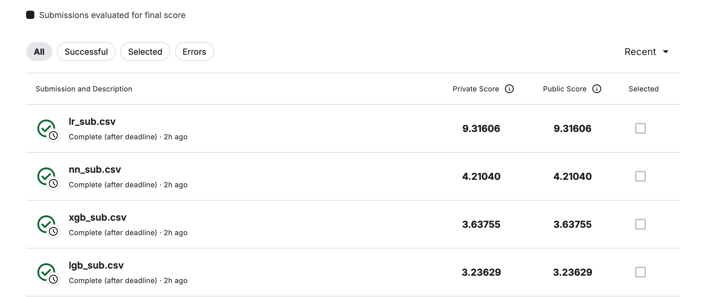

# New York City Taxi Fare Prediction

This repository contains my solutions for the [New York City Taxi Fare Prediction](https://www.kaggle.com/competitions/new-york-city-taxi-fare-prediction/overview) competition on Kaggle. The goal of the competition is to predict the fare amount for taxi rides in New York City based on pickup and dropoff locations, among other features.

## Objective

The task is to accurately predict taxi fares using machine learning techniques. The performance of each model is evaluated using Root Mean Square Error (RMSE).

## Models Used

I experimented with multiple machine learning models for this regression task. Below are the models I used, along with their respective RMSE scores:

- **LightGBM**  
  RMSE: **3.23629**

- **XGBoost**  
  RMSE: **3.63755**

- **Neural Networks**  
  RMSE: **4.21040**

- **Linear Regression**  
  RMSE: **9.31606**

## Insights

- **Linear Regression**: While simple to implement, it produced the highest RMSE score, showing that it is not well-suited for capturing the complexities in this dataset.
- **Neural Networks**: A deep learning-based model performed significantly better than linear regression, reducing the RMSE score by over 5 points.
- **XGBoost**: XGBoost, a popular tree-based algorithm, provided further improvement over Neural Networks, but there was still room for better predictions.
- **LightGBM**: The best performing model was LightGBM, a gradient boosting algorithm. It produced the lowest RMSE score of 3.23629, making it the most effective model for this problem.

## Conclusion

This project highlights the effectiveness of gradient boosting algorithms, particularly **LightGBM**, in predictive tasks involving structured data. Although other models like **Neural Networks** also performed well, the tree-based algorithms showed superior results in terms of RMSE.

For more details on the competition and the dataset, check out the [Kaggle Competition Page](https://www.kaggle.com/competitions/new-york-city-taxi-fare-prediction/overview).
